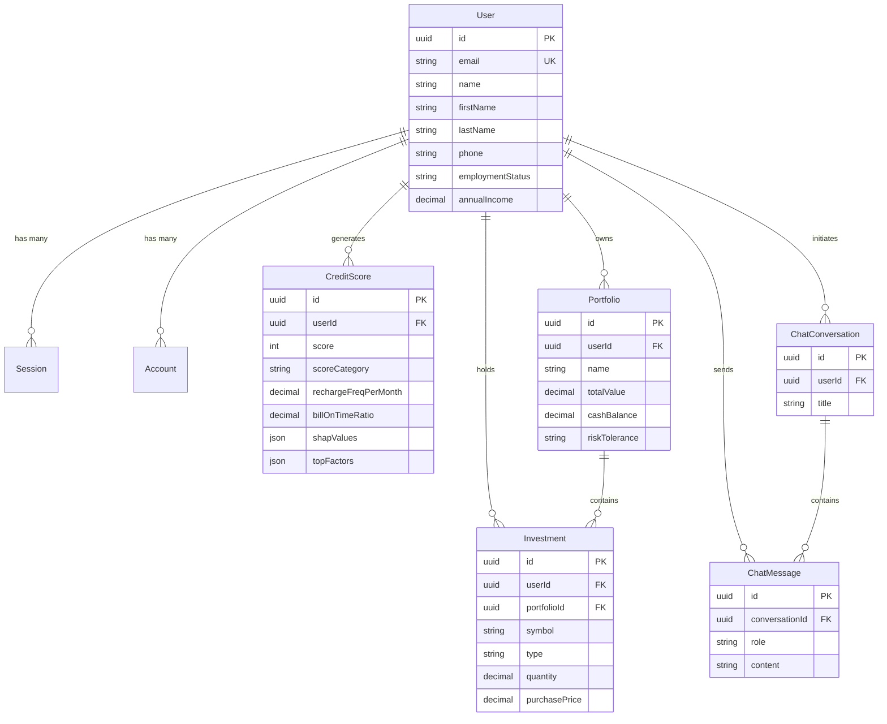

# 🚀 CredSage AI — Complete Master Project Documentation

Welcome to the definitive master documentation for **CredSage AI**. This document provides an exhaustive, single-source-of-truth reference covering the architecture, data models, machine learning models, backend APIs, frontend component systems, authentication workflows, environment setup, and deployment guides for the entire CredSage AI ecosystem.

---

## 📋 Table of Contents
1. [Executive Summary & Project Overview](#-1-executive-summary--project-overview)
2. [System Architecture & Tech Stack](#-2-system-architecture--tech-stack)
3. [Monorepo & Directory Structure](#-3-monorepo--directory-structure)
4. [Database Schema & Data Models (Prisma PostgreSQL)](#-4-database-schema--data-models-prisma-postgresql)
5. [Complete API Route Directory](#-5-complete-api-route-directory)
   - [Frontend Client Routes](#-frontend-client-routes)
   - [Backend Express API Endpoints](#-backend-express-api-endpoints)
   - [ML Microservice FastAPI Endpoints](#-ml-microservice-fastapi-endpoints)
6. [Machine Learning & Explainable AI (XAI) Engine](#-6-machine-learning--explainable-ai-xai-engine)
7. [Frontend Application & UI Component System](#-7-frontend-application--ui-component-system)
8. [Authentication, Authorization & Security](#-8-authentication-authorization--security)
9. [Environment Configuration & Variables](#-9-environment-configuration--variables)
10. [Local Development & Deployment Guide](#-10-local-development--deployment-guide)

---

## 🌟 1. Executive Summary & Project Overview

**CredSage AI** is an end-to-end, AI-native credit scoring and micro-investment platform built to bridge the financial inclusion gap for unbanked, underbanked, and gig-economy individuals. Traditional credit rating agencies (e.g. CIBIL, FICO) rely heavily on credit card history, formal loans, and mortgage records—excluding millions of individuals who lack traditional credit histories.

CredSage AI addresses this by evaluating **alternative financial footprints** (mobile recharge regularity, utility bill timeliness, EMI compliance, digital wallet volatility) through a **CatBoost Machine Learning model**, explaining decisions using **SHAP (SHapley Additive exPlanations)**, and delivering human-friendly advice via **Groq Llama 3-8B LLM**.

Furthermore, CredSage AI automatically pairs calculated credit profiles with **tailored micro-investment recommendations** (index funds, gold bonds, low-risk ETFs) and **compound growth simulators**, enabling users to build wealth progressively.

### Key Value Propositions
* **Alternative Data Credit Scoring**: Generates credit scores (300–850) without relying on traditional credit bureau histories.
* **Explainable AI (XAI)**: SHAP-driven factor analysis explaining exact positive and negative drivers behind a user's score.
* **Generative AI Financial Advisor**: Conversational AI assistant powered by Groq & Llama 3-8B for instant financial coaching and advice.
* **Personalized Micro-Investments**: Risk-profile questionnaire coupled with multi-scenario compound interest projections (6%, 10%, 14%).
* **Enterprise Auth & Security**: Built with Better Auth, Google OAuth 2.0, session cookies, rate limiting, and PostgreSQL row isolation.

---

## 📐 2. System Architecture & Tech Stack

The platform is designed as a modular monorepo containing three core services: the **React Frontend SPA**, the **Node.js/Express REST API**, and the **Python FastAPI ML Microservice**.

```
                                 ┌─────────────────────────┐
                                 │   Frontend (Vite React) │
                                 │      Port: 5173         │
                                 └────────────┬────────────┘
                                              │ HTTP / REST (Axios / TanStack)
                                              ▼
                                 ┌─────────────────────────┐
                                 │  Backend API (Express)  │
                                 │      Port: 3000         │
                                 └──────┬───────────┬──────┘
                                        │           │
                       Prisma ORM 7     │           │ HTTP / REST
                       (PostgreSQL)     │           │
                                        ▼           ▼
                           ┌─────────────────┐  ┌───────────────────────┐
                           │ Neon PostgreSQL │  │ ML Service (FastAPI)  │
                           │    Database     │  │      Port: 8000       │
                           └─────────────────┘  └───────────┬───────────┘
                                                            │ Groq SDK
                                                            ▼
                                                    ┌───────────────┐
                                                    │ Llama 3 LLM   │
                                                    └───────────────┘
```

### 🛠️ Technology Matrix

| Layer | Framework / Tool | Version | Purpose & Responsibilities |
| :--- | :--- | :--- | :--- |
| **Frontend Framework** | React | `^18.3.1` | Single Page Application (SPA) UI |
| **Build Tool & Bundler** | Vite | `^6.0.5` | Fast HMR development & optimized production build |
| **Language** | TypeScript | `^5.6.3` | End-to-end type safety |
| **Styling** | Tailwind CSS | `^3.4.17` | Utility-first responsive design & dark/light theme |
| **Server State** | TanStack React Query | `^5.62.11` | API query caching, mutation management, background revalidation |
| **Client State** | Zustand | `^5.0.2` | Global UI & session state management |
| **UI Components & Icons** | Lucide React / Recharts | `^0.469.0` | Modern vector icons and interactive compound growth charts |
| **Backend Framework** | Node.js / Express | `^4.21.2` | Core application business logic & RESTful endpoints |
| **Database ORM** | Prisma ORM | `^7.3.0` | Type-safe query engine, migrations, relational mapping |
| **Database Engine** | Neon PostgreSQL | Serverless | Cloud-hosted relational database for persistent storage |
| **Authentication** | Better Auth | `^1.1.14` | Session management, password hashing, Google OAuth social login |
| **Request Validation** | Zod | `^3.24.1` | Runtime payload schema validation & sanitization |
| **ML Microservice** | Python / FastAPI | `3.10+` / `^0.109.0` | Asynchronous ML inference server |
| **ML Scoring Engine** | CatBoost / Scikit-Learn | `^1.2.2` | Gradient boosted decision trees trained on alternative credit metrics |
| **Explainable AI** | SHAP | `^0.44.1` | Game-theoretic feature attribution calculations |
| **Generative AI** | Groq SDK / Llama 3-8B | `^0.4.2` | Fast LLM inference for natural language credit insights & chatbot |

---

## 📂 3. Monorepo & Directory Structure

The project is structured as an `npm workspace` monorepo allowing unified dependency management and concurrent script execution.

```
credsage_ai/
├── package.json                    # Monorepo root manifest with concurrent run scripts
├── .env                            # Shared / environment configurations
├── PROJECT_DOCUMENTATION.md        # Core project documentation summary
├── FRONTEND_DOCUMENTATION.md       # Frontend-specific architecture guide
├── FULL_PROJECT_DOCUMENTATION.md   # [THIS FILE] Complete single-source master documentation
│
├── backend/                        # Express API Backend Node.js Service
│   ├── package.json                # Backend dependencies (Express, Prisma, Better Auth, Zod)
│   ├── tsconfig.json               # TypeScript configuration
│   ├── prisma/
│   │   └── schema.prisma           # Prisma 7 database schema definition (PostgreSQL)
│   └── src/
│       ├── app.ts                  # Express application setup, security headers & route mounts
│       ├── server.ts               # HTTP server bootstrap & DB connection listener
│       ├── config/                 # Environment variables parsing & Prisma instance
│       │   ├── env.ts              # Zod-validated environment config schema
│       │   └── db.ts               # Prisma Client instantiation
│       ├── lib/
│       │   └── auth.ts             # Better Auth server instance & OAuth provider configuration
│       ├── middleware/             # HTTP Middlewares
│       │   ├── auth.middleware.ts  # Session authentication guard
│       │   ├── validate.middleware.ts # Zod schema validation middleware
│       │   └── error.middleware.ts # Global error handling & 404 handler
│       ├── modules/                # Domain-Driven Architecture Modules
│       │   ├── user/               # Profile management, financial info & user stats
│       │   │   ├── user.routes.ts
│       │   │   ├── user.controller.ts
│       │   │   └── user.service.ts
│       │   ├── credit/             # Credit score calculation & historical records
│       │   │   ├── credit.routes.ts
│       │   │   ├── credit.controller.ts
│       │   │   └── credit.service.ts
│       │   ├── investment/         # Portfolios, asset holdings & AI recommendations
│       │   │   ├── investment.routes.ts
│       │   │   ├── investment.controller.ts
│       │   │   └── investment.service.ts
│       │   └── chatbot/            # AI Assistant chat thread and message operations
│       │       ├── chatbot.routes.ts
│       │       ├── chatbot.controller.ts
│       │       └── chatbot.service.ts
│       └── utils/                  # Helper utilities & Winston logger
│
├── frontend/                       # React 18 + Vite Frontend SPA
│   ├── package.json                # Frontend dependencies
│   ├── vite.config.ts              # Vite dev server, paths & proxy settings
│   ├── tailwind.config.js          # Tailwind CSS theme extension
│   ├── src/
│   │   ├── App.tsx                 # App layout wrapper & React Router routes definition
│   │   ├── main.tsx                # Entry point mounting React Query & React DOM
│   │   ├── pages/                  # Top-level Page Views
│   │   │   ├── LandingPage.tsx     # Public home page
│   │   │   ├── Login.tsx           # User authentication login view
│   │   │   ├── SignUp.tsx          # Account registration view
│   │   │   ├── Dashboard.tsx       # Main user dashboard summary
│   │   │   ├── CreditPage.tsx      # Alternative credit calculator & SHAP view
│   │   │   ├── PortfolioPage.tsx   # Portfolio creation & asset holdings manager
│   │   │   ├── RecommendationsPage.tsx # AI micro-investment recommendations & growth graph
│   │   │   ├── RiskProfilePage.tsx # 8-step risk assessment questionnaire
│   │   │   └── ChatbotPage.tsx     # Financial AI Assistant chat interface
│   │   ├── components/             # UI Components & Layouts
│   │   │   ├── layouts/
│   │   │   │   ├── AuthLayout.tsx  # Layout wrapper for login/signup
│   │   │   │   └── MainLayout.tsx  # Authenticated sidebar layout wrapper
│   │   │   ├── ui/
│   │   │   │   ├── Sidebar.tsx     # Navigation sidebar
│   │   │   │   └── Navbar.tsx      # Header navbar
│   │   │   └── ProtectedRoute.tsx  # Auth guard component
│   │   ├── services/               # API Integration Services (Axios)
│   │   │   ├── authService.ts      # Profile & authentication endpoints
│   │   │   ├── creditService.ts    # Credit scoring API caller
│   │   │   ├── investmentService.ts# Portfolio & investment API caller
│   │   │   └── chatService.ts      # Chatbot conversation caller
│   │   ├── store/                  # Client state (Zustand)
│   │   │   └── authStore.ts        # Session & user data store
│   │   ├── hooks/                  # Custom React Query Hooks
│   │   ├── lib/
│   │   │   └── auth.client.ts      # Better Auth client library instance
│   │   └── utils/
│   │       └── api.ts              # Pre-configured Axios instance with interceptors
│
└── ml-service/                     # Python 3.10+ FastAPI Microservice
    ├── main.py                     # FastAPI application entry point & route definitions
    ├── requirements.txt            # Python dependencies (FastAPI, CatBoost, SHAP, Groq)
    ├── app/
    │   ├── config.py               # Settings & environment parser
    │   └── models/
    │       └── credit_scorer.py    # CatBoost model loader & SHAP calculator
    └── models/
        └── credit_model.cbm        # Pre-trained CatBoost model binary file
```

---

## 🗄️ 4. Database Schema & Data Models (Prisma PostgreSQL)

The database schema is managed via **Prisma ORM 7** targeting a serverless **Neon PostgreSQL** database.



### 📋 Complete Entity Specifications

#### 1. `User` (`user`)
Stores user profiles, personal details, and financial demographics.
* `id` (`Uuid`, Primary Key)
* `email` (`VarChar(255)`, Unique)
* `emailVerified` (`Boolean`, Default: `false`)
* `name`, `firstName`, `lastName` (`VarChar`)
* `phone`, `dateOfBirth`, `address`, `city`, `state`, `zipCode`, `country`
* `employmentStatus` (`VarChar(50)`): e.g. `employed`, `self-employed`, `gig-worker`, `student`
* `annualIncome` (`Decimal(12, 2)`): Self-reported income
* `createdAt`, `updatedAt` (`Timestamptz`)

#### 2. `Session` (`session`) & `Account` (`account`)
Better Auth authentication management models.
* `Session`: Stores active web tokens, user IP, user agent, and expiration timestamp.
* `Account`: Manages OAuth linkages (e.g. Google OAuth credentials) and hashed passwords.

#### 3. `CreditScore` (`credit_scores`)
Stores generated alternative credit scores and SHAP analysis.
* `id` (`Uuid`, Primary Key)
* `userId` (`Uuid`, Foreign Key -> `User.id`)
* `score` (`Int`): Calculated score between 300 and 850.
* `scoreCategory` (`VarChar(50)`): `Excellent`, `Good`, `Fair`, or `Poor`.
* **Input Metrics**:
  * `rechargeFreqPerMonth` (`Decimal`)
  * `avgRechargeValue` (`Decimal`)
  * `rechargeGapStd` (`Decimal`)
  * `billOnTimeRatio` (`Decimal`)
  * `avgDaysLate` (`Decimal`)
  * `autopayEnrolled` (`Boolean`)
  * `monthlySpendVolatility` (`Decimal`)
  * `emiUsageRate` (`Decimal`)
  * `orderFreqTrend` (`Decimal`)
  * `phoneTenureMonths` (`Int`)
* **ML & Explainability Data**:
  * `modelVersion` (`VarChar(50)`)
  * `confidence` (`Decimal(5, 4)`)
  * `shapValues` (`JsonB`): Key-value dictionary of SHAP feature impact scores.
  * `topFactors` (`JsonB`): Ranked array of positive and negative drivers.

#### 4. `Portfolio` (`portfolios`)
Manages investment portfolios per user.
* `id` (`Uuid`, Primary Key)
* `userId` (`Uuid`, Foreign Key -> `User.id`)
* `name` (`VarChar(255)`): e.g. "Main Retirement", "Micro-Savings"
* `totalValue` (`Decimal(18, 4)`)
* `cashBalance` (`Decimal(18, 4)`)
* `riskTolerance` (`VarChar(50)`): `low`, `medium`, `high`
* `investmentHorizon` (`VarChar(50)`): `short`, `medium`, `long`
* `totalReturn`, `totalReturnPercent` (`Decimal`)
* `isActive` (`Boolean`, Default: `true`)

#### 5. `Investment` (`investments`)
Individual asset holdings inside portfolios.
* `id` (`Uuid`, Primary Key)
* `userId` (`Uuid`, Foreign Key -> `User.id`)
* `portfolioId` (`Uuid`, Foreign Key -> `Portfolio.id`)
* `symbol` (`VarChar(20)`): e.g. `NIFTYBEES`, `SGB2024`, `RELIANCE`
* `name` (`VarChar(255)`): Asset name
* `type` (`VarChar(50)`): `stock`, `etf`, `bond`, `crypto`
* `quantity` (`Decimal(18, 8)`)
* `purchasePrice`, `currentPrice` (`Decimal(18, 4)`)
* `totalValue`, `profitLoss`, `profitLossPercent` (`Decimal`)

#### 6. `ChatConversation` (`chat_conversations`) & `ChatMessage` (`chat_messages`)
Threads and message logs for the Groq AI Advisor.
* `ChatConversation`: Holds thread title, context category, and timestamp.
* `ChatMessage`: Stores `role` (`user` | `assistant` | `system`), markdown `content`, token usage, and associated credit/investment snapshot references.

---

## 🌐 5. Complete API Route Directory

### 🖥️ Frontend Client Routes

Mounted in `frontend/src/App.tsx`:

| Route Path | Component File | Access Control | Layout | Purpose |
| :--- | :--- | :--- | :--- | :--- |
| `/` | `LandingPage.tsx` | Dynamic | Public Landing | Marketing hero page; redirects authenticated users to `/dashboard`. |
| `/login` | `Login.tsx` | Public | `AuthLayout` | Email/password and Google OAuth authentication. |
| `/signup` | `SignUp.tsx` | Public | `AuthLayout` | Account registration page. |
| `/dashboard` | `Dashboard.tsx` | `ProtectedRoute` | `MainLayout` | Central overview of credit score, assets, and quick links. |
| `/credit` | `CreditPage.tsx` | `ProtectedRoute` | `MainLayout` | Alternative credit calculator, score gauge & SHAP factors. |
| `/portfolio` | `PortfolioPage.tsx` | `ProtectedRoute` | `MainLayout` | Portfolio creation and asset manager (stocks, ETFs, bonds, crypto). |
| `/recommendations` | `RecommendationsPage.tsx` | `ProtectedRoute` | `MainLayout` | AI asset recommendations & 3-scenario growth projection graph. |
| `/risk-profile` | `RiskProfilePage.tsx` | `ProtectedRoute` | `MainLayout` | 8-question risk questionnaire syncing directly to user portfolio. |
| `/chatbot` | `ChatbotPage.tsx` | `ProtectedRoute` | `MainLayout` | Conversational Groq AI Financial Advisor. |
| `*` | Fallback | Redirect | N/A | Catches 404s and redirects appropriately based on session state. |

---

### ⚡ Backend Express API Endpoints (Port 3000)

All protected routes require an active session cookie or Bearer token managed by Better Auth.

#### 1. Authentication & System
* `GET /health` — Application health check
* `GET /api/health` — API status health check
* `ALL /api/auth/*` — Better Auth handler endpoints (sign-in, sign-up, session validation, OAuth callback, sign-out)

#### 2. User & Financial Profile (`/api/users`)
* `GET /api/users/profile` — Fetch current user profile details
* `PUT /api/users/profile` — Update user personal and financial demographics
* `DELETE /api/users/account` — Permanent account deletion
* `GET /api/users/stats` — Fetch aggregate financial statistics across credit and investments
* `GET /api/users/session` — Return active session metadata

#### 3. Credit Scoring Engine (`/api/credit`)
* `POST /api/credit/score` — Submit alternative financial metrics to generate a new credit score
* `GET /api/credit/history` — Fetch historical score records for the authenticated user
* `GET /api/credit/latest` — Fetch the most recently computed credit score
* `GET /api/credit/stats` — Fetch credit score metrics (high, low, average, trend)
* `GET /api/credit/:id` — Get detailed breakdown of a specific score entry
* `GET /api/credit/:id/factors` — Fetch SHAP explanation factors for a specific score
* `DELETE /api/credit/:id` — Delete a credit score entry

#### 4. Portfolios & Asset Investments (`/api/investment`)
* `POST /api/investment/portfolio` — Create a new portfolio
* `GET /api/investment/portfolio` — Fetch user's portfolios
* `GET /api/investment/portfolio/:id` — Fetch portfolio details by ID
* `PUT /api/investment/portfolio/:id` — Update portfolio parameters (risk profile, cash balance)
* `DELETE /api/investment/portfolio/:id` — Delete a portfolio
* `GET /api/investment/portfolio/:id/stats` — Get portfolio performance & asset breakdown
* `POST /api/investment/investment` — Add a new investment position to a portfolio
* `GET /api/investment/investment` — List all user investment holdings
* `GET /api/investment/investment/:id` — Get specific investment holding details
* `PUT /api/investment/investment/:id` — Update holding price, quantity, or current market price
* `DELETE /api/investment/investment/:id` — Remove an investment holding
* `GET /api/investment/recommendations` — Fetch personalized asset recommendations based on risk score
* `GET /api/investment/analytics` — Overall investment analytics across all holdings

#### 5. AI Advisor Chatbot (`/api/chatbot`)
* `POST /api/chatbot/message` — Send user message to financial chatbot (forwards context to Groq API)
* `GET /api/chatbot/conversations` — List user conversation threads
* `GET /api/chatbot/conversations/:id` — Get thread details
* `PUT /api/chatbot/conversations/:id` — Update conversation title
* `DELETE /api/chatbot/conversations/:id` — Delete conversation thread
* `GET /api/chatbot/conversations/:conversationId/messages` — Fetch message history for thread
* `DELETE /api/chatbot/history` — Wipe user's entire chatbot history

---

### 🧠 ML Microservice FastAPI Endpoints (Port 8000)

* `GET /` — Microservice status & model version info
* `GET /health` — Service health check & CatBoost binary load check
* `GET /docs` — Interactive Swagger OpenAPI documentation
* `POST /api/v1/credit/predict` — Runs CatBoost prediction, computes SHAP values, and queries Groq LLM for natural language insights
* `GET /api/v1/credit/insights/{id}` — Extended diagnostic insights endpoint
* `GET /api/v1/models/info` — ML model feature names and score bounds (300-850)

---

## 🤖 6. Machine Learning & Explainable AI (XAI) Engine

### 1️⃣ CatBoost Credit Scoring Model
The core credit score calculation runs on a pre-trained **CatBoost** model trained on non-traditional financial indicators. 

#### Model Inputs (10 Features):
1. `recharge_freq_per_month` (Float): Mobile recharge frequency per month (e.g. 4.0).
2. `avg_recharge_value` (Float): Average monetary value of recharges in INR (e.g. ₹399).
3. `recharge_gap_std` (Float): Standard deviation of days between recharges (measures regularity).
4. `bill_on_time_ratio` (Float, 0.0 - 1.0): Percentage of utility/bill payments made on time.
5. `avg_days_late` (Float): Average delay in bill payment when late.
6. `autopay_enrolled` (Boolean): Enrolled in automatic recurring bill payments.
7. `monthly_spend_volatility` (Float): Coefficient of variation of monthly digital payments.
8. `emi_usage_rate` (Float, 0.0 - 1.0): Ratio of monthly income allocated to EMIs.
9. `order_freq_trend` (Float): Positive/negative trend in e-commerce/utility transactions.
10. `phone_tenure_months` (Int): Months of active SIM/phone ownership.

#### Output Range:
* **Score**: 300 to 850 (Scaled to match standard credit score ranges).
* **Category Mapping**:
  * **800 - 850**: `Excellent` (Green)
  * **700 - 799**: `Good` (Blue)
  * **600 - 699**: `Fair` (Yellow)
  * **300 - 599**: `Poor` (Red)

---

### 2️⃣ SHAP (SHapley Additive exPlanations)
To eliminate black-box AI opacity, every prediction includes a SHAP factor calculation evaluating how much each input feature pushed the score above or below the baseline model average.

* **Positive Drivers**: Features like high `bill_on_time_ratio` (e.g. 0.98) or long `phone_tenure_months` (e.g. 48) add positive points (+35 pts).
* **Negative Drivers**: High `monthly_spend_volatility` or frequent `avg_days_late` subtract points (-42 pts).
* **UI Visualization**: Displayed as color-coded impact pills in `CreditPage.tsx`.

---

### 3️⃣ Groq Llama 3-8B Natural Language Insights
Upon scoring completion, the FastAPI microservice sends the score, category, and top 3 SHAP drivers to **Groq LLM** (`llama3-8b-8192`) via prompt engineering:

```json
{
  "textExplanation": "Your score of 745 (Good) is strongly boosted by your 95% on-time bill payment record and 36-month SIM tenure. However, your EMI usage rate slightly lowers your score.",
  "improvementRecommendations": [
    "Reduce active EMI usage below 20% of monthly spend.",
    "Enroll utility bills in Autopay to reach 100% on-time payment ratio."
  ]
}
```

---

## 🎨 7. Frontend Application & UI Component System

### 1️⃣ Design Tokens & Styling
The frontend utilizes modern UI principles:
* **Color Palette**: Dark Slate (`#0f172a`), Deep Indigo (`#4338ca`), Emerald (`#10b981`), Rose (`#f43f5e`), and Glassmorphism cards (`backdrop-blur-md bg-white/10`).
* **Typography**: Clean sans-serif with strong hierarchical contrast.
* **Data Visualization**: Recharts interactive line & area charts with dynamic tooltips.

---

### 2️⃣ Feature Modules Matrix

```
┌─────────────────────────────────────────────────────────────────────────────┐
│                            CredSage Dashboard                               │
├─────────────────┬───────────────────────────────────────────────────────────┤
│ Sidebar Nav     │ Main Viewport Component                                  │
│                 │                                                           │
│ 📊 Dashboard    │ ┌──────────────────────┐ ┌──────────────────────────────┐ │
│ 💳 Credit Score │ │ Score Gauge: 742/850 │ │ Financial Stats Cards        │ │
│ 📈 Portfolio    │ └──────────────────────┘ └──────────────────────────────┘ │
│ 🎯 AI Advice    │ ┌───────────────────────────────────────────────────────┐ │
│ 💬 Chatbot      │ │ Recharts 10-Year Compound Growth Simulator            │ │
│ ⚙️ Risk Profile │ └───────────────────────────────────────────────────────┘ │
└─────────────────┴───────────────────────────────────────────────────────────┘
```

#### Module Highlights:
1. **Credit Score Calculator (`CreditPage.tsx`)**: Slider & numeric form for alternative metrics, score gauge component, SHAP driver breakdown, and calculation history log.
2. **Risk Questionnaire (`RiskProfilePage.tsx`)**: Step-by-step 8-question wizard determining risk tolerance (`low`, `medium`, `high`) and syncing directly with backend portfolios.
3. **AI Recommendations & Growth Simulator (`RecommendationsPage.tsx`)**: Recharts multi-scenario compound interest calculator comparing 6%, 10%, and 14% annual returns over 1–10 year horizons.
4. **Asset Manager (`PortfolioPage.tsx`)**: Portfolio selector, cash balance manager, live profit & loss calculator (₹ gain/loss and percentage return).
5. **AI Financial Advisor (`ChatbotPage.tsx`)**: Groq-powered chat interface supporting context-aware financial advice and conversation history clearing.

---

## 🔐 8. Authentication, Authorization & Security

CredSage AI implements enterprise-grade authentication using **Better Auth**:

* **Session Token Storage**: Uses secure, `HttpOnly`, `SameSite=Lax` cookies for Web session management.
* **OAuth 2.0 Integration**: Native Google OAuth authentication via Better Auth provider configuration.
* **Backend Session Guards**: Custom Express middleware (`auth.middleware.ts`) extracts and verifies session tokens prior to routing requests to controllers.
* **Security Middlewares**:
  * **Helmet.js**: Sets security HTTP headers (X-Frame-Options, CSP, HSTS).
  * **CORS Protection**: Whitelists trusted frontend origins (`http://localhost:5173`).
  * **Rate Limiting**: `express-rate-limit` prevents brute-force attempts (100 requests per 15 minutes per IP).
  * **Zod Input Sanitization**: Validates and strips unauthorized payload attributes.

---

## ⚙️ 9. Environment Configuration & Variables

To run the complete stack, configure the `.env` files in their respective workspace directories.

### 1️⃣ Root / Backend `.env` (`backend/.env`)
```env
# Database Connections (Neon PostgreSQL)
DATABASE_URL="postgresql://<user>:<password>@<neon-host>/credsage_db?sslmode=require"
DIRECT_URL="postgresql://<user>:<password>@<neon-host>/credsage_db?sslmode=require"

# Server Configuration
PORT=3000
NODE_ENV=development

# Better Auth Configuration
BETTER_AUTH_SECRET="your-32-character-secret-key-goes-here"
BETTER_AUTH_URL="http://localhost:3000"
BETTER_AUTH_TRUST_HOST="true"

# Google OAuth Credentials
GOOGLE_CLIENT_ID="your-google-client-id.apps.googleusercontent.com"
GOOGLE_CLIENT_SECRET="your-google-client-secret"

# Microservices & CORS
ML_SERVICE_URL="http://localhost:8000"
CORS_ORIGIN="http://localhost:5173,http://localhost:5174"
```

### 2️⃣ Frontend `.env` (`frontend/.env`)
```env
VITE_API_URL="http://localhost:3000/api"
VITE_BETTER_AUTH_URL="http://localhost:3000"
VITE_APP_NAME="CredSage AI"
VITE_APP_VERSION="1.0.0"
```

### 3️⃣ ML Microservice `.env` (`ml-service/.env`)
```env
PORT=8000
ENVIRONMENT=development
LOG_LEVEL=INFO
MODEL_PATH="models/credit_model.cbm"
MODEL_VERSION="1.0.0"
GROQ_API_KEY="gsk_your_groq_api_key_here"
```

---

## 🚀 10. Local Development & Deployment Guide

### Prerequisites
* **Node.js**: `v18.0.0` or higher
* **npm**: `v9.0.0` or higher
* **Python**: `v3.10` or higher
* **PostgreSQL**: Neon cloud database instance (or local PostgreSQL 14+)

---

### Step-by-Step Installation

#### 1. Clone & Install Monorepo Dependencies
```bash
# Clone repository
git clone https://github.com/your-org/credsage_ai.git
cd credsage_ai

# Install root & workspace npm packages
npm install
```

#### 2. Configure Database & Prisma
```bash
# Navigate to backend directory
cd backend

# Generate Prisma Client types
npm run prisma:generate

# Push schema migrations to Neon PostgreSQL
npx prisma db push
```

#### 3. Setup ML Microservice (Python)
```bash
# Navigate to ml-service directory
cd ../ml-service

# Create virtual environment
python -m venv venv

# Activate virtual environment (Windows)
.\venv\Scripts\activate

# Activate virtual environment (macOS/Linux)
# source venv/bin/activate

# Install Python dependencies
pip install -r requirements.txt
```

---

### Running the Application

#### Option A: Concurrent Start (Frontend + Backend)
From the root directory:
```bash
# Starts both Express backend (Port 3000) and Vite frontend (Port 5173)
npm run dev
```

#### Option B: Start Individual Services

**Start Express Backend**:
```bash
npm run dev:backend
```

**Start Vite Frontend**:
```bash
npm run dev:frontend
```

**Start FastAPI ML Service**:
```bash
cd ml-service
python main.py
# Server starts at http://localhost:8000 (Swagger docs at http://localhost:8000/docs)
```

---

### Production Build & Verification

To verify production builds prior to deployment:
```bash
# Build frontend static assets
cd frontend
npm run build

# Build backend TypeScript code
cd ../backend
npm run build
```

---

*Documentation compiled and maintained for CredSage AI — Complete Master Repository Reference.*
